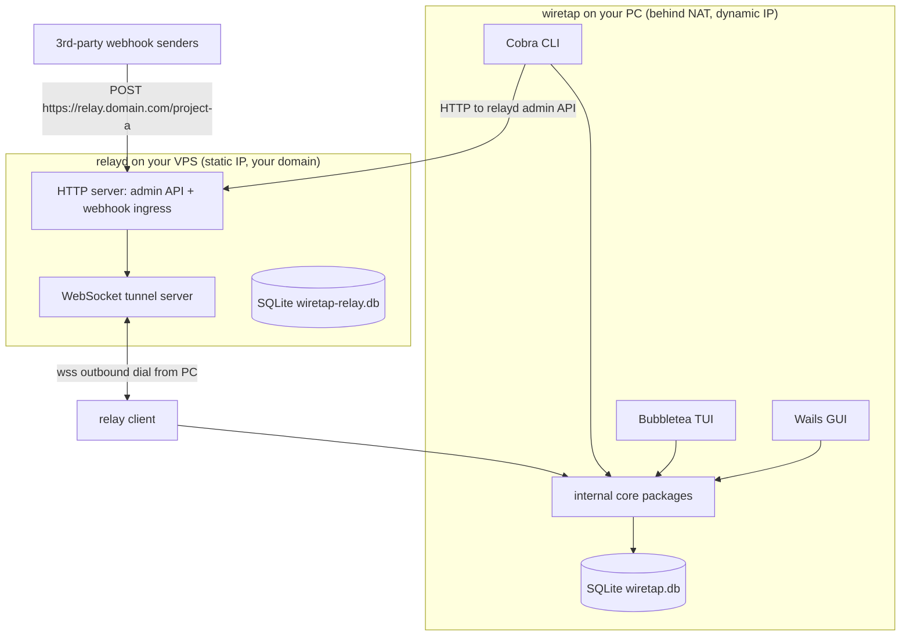
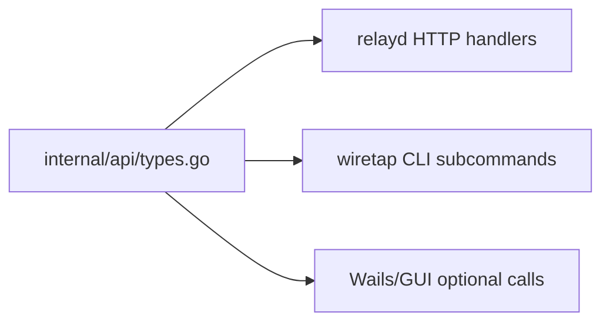

# wiretap — Project Plan

> Capture HTTP traffic and webhooks locally, replay them, and receive inbound
> webhooks from the internet via a self-hosted relay on your VPS — all from one
> CLI/GUI/TUI app. Linux first; Windows + macOS behind build tags later.

---

## 0. Current status (for fresh agents)

> This section summarises the state of the project. It is the single source
> of truth for "what's landed" when picking up the project without prior
> context. Update it whenever a phase completes or statuses change.

| Phase | Status | Lead commits |
|---|---|---|
| 0 — Scaffolding | ✅ DONE | `35a34f9` |
| 1 — Cross-cutting cores | ✅ DONE | `7683597`, `0bf277a`, `171325c` |
| 2 — relayd HTTP + tunnel | ✅ DONE | `92c354b`, `37fb6a4` |
| 3 — PC relay client + CLI | ✅ DONE | `8479067`, `b01b8b1`, `7af7334` |
| 4 — Traffic interception | ⬜ NOT STARTED | -- |
| 5 — Wails GUI | ⬜ NOT STARTED | -- |
| 6 — Hardening | ⬜ NOT STARTED | -- |

Latest commit on `main`: `7af7334`. Calendar date July 2026 (this is just a
reference; treat the commit graph as ground truth).

All tests pass under `go test -race -shuffle=on ./...`. Coverage per package:

| Package | Coverage | Notes |
|---|---|---|
| `internal/relayproto` | 97.6% | Sealed Message union |
| `internal/intercept/shellscript` | 99.1% | Golden-file tested |
| `internal/relayclient` | 84.8% | Dialer/Conn/Backoff fakes |
| `internal/cli` | ~73% | Relay subcommands + TUI seam |
| `internal/api` | 74.7% | Typed HTTPClient |
| `internal/config` | 74.6% | Includes credentials round-trip |
| `internal/store` | 64.4% | Real `:memory:` SQLite |
| `internal/relayd` | 70.9% | httptest + real WebSocket |
| `internal/tui` | 64.7% | Polls PCStore, truncate tested |
| `internal/testutil` | 36.4% | Golden helper + fake clock/idgen |
| `cmd/wiretap-relay` | 21.4% | HTTP handler + graceful shutdown |

Commit messages follow Conventional Commits; a `commit-msg` hook backed by
`@commitlint/cli` enforces this locally. See `commitlint.config.js` for the
accepted types and scopes.

`README.md` is intentionally untracked. It will be revisited at the end of
the project. Don't stage it via `git add -A` without excluding it.

## 1. Goals & non-goals

### Goals (MVP)

1. Intercept outbound HTTP/HTTPS traffic from a spawned shell via an MITM proxy
   (httptoolkit-style env injection), with `stop_interception` for **every** shell.
2. Capture inbound webhooks over the internet using a self-hosted relay (`relayd`)
   on your VPS, with store-and-forward so the local PC never misses a webhook while
   offline.
3. Persist captures in SQLite on both PC and relay; replay any captured webhook.
4. Clean Wails GUI dashboard with two tab modes: **Traffic** and **Webhooks**.
5. Bubbletea TUI behind `wiretap tui`; one-shot CLI via Cobra.
6. Every relay administration capability exposed as **both HTTP routes and CLI
   subcommands** (one API contract, two frontends).
7. Linux-first, cross-platform-ready via build-tag-split seams.
8. Code written to be **testable by default** — this is a Go-learning project, so
   tests are a first-class deliverable, not an afterthought.

### Non-goals (MVP)

- Multi-tenant relay (single owner, single `admin_token`; the schema can grow later).
- Fuzz-testing, formal verification, performance benchmarking at scale.
- Non-HTTPS traffic interception (plain HTTP on port 80) — covered later.
- Mobile clients.
- Authenticated webhook forwarding to multiple downstreams per project (one tunnel
  per client is enough for MVP).

---

## 2. Architecture overview



**Key invariant:** the PC always dials **out** to the VPS (WebSocket over TLS),
so NAT / CGNAT / dynamic home IP never matter. The relay stores webhooks in its
own SQLite and pushes them down the tunnel; the PC acks per-project cursors.

---

## 3. Repository layout

```
wiretap/
  .go-version
  go.mod                                  # module github.com/plutack/wiretap
  LICENSE
  README.md
  docs/
    PLAN.md                               # this file
  cmd/
    wiretap/                              # local app (CLI + TUI + GUI host)
      main.go                            # cobra root; dispatches to subcommands
    wiretap-relay/                       # standalone relay server binary for the VPS (package main; binary name `wiretap-relay`)
      main.go
  internal/
    app/                                 # wires deps together for the local app
    config/                              # Viper config loading, paths, defaults
    api/                                 # shared request/response types (HTTP contract)
      client.go                          # typed HTTP client used by CLI
      server.go                          # handler constructors (used by relayd)
      types.go                           # DTOs: Client, Project, Webhook, etc.
    store/                               # SQLite (modernc.org/sqlite, pure Go)
      migrations/                        # *.sql files, applied in order
      pc.go                              # local PC store: webhooks, captures, cursor
      relay.go                           # relay store: clients, projects, webhooks
      pc_test.go
      relay_test.go
      testutil_test.go                   # helpers for opening an isolated SQLite
    intercept/                           # traffic interception
      proxy/                             # MITM proxy core (pluggable transport)
      shellscript/                       # per-shell script generators
        bash.go bash_test.go
        fish.go fish_test.go
        powershell.go powershell_test.go
        gitbash.go gitbash_test.go
        doc.go                           # ShellScript(env) -> string dispatcher
      overridebin/                       # shim scripts for git/curl/node/etc.
      castore/                           # CA install (build-tag split)
        castore.go                        # interface
        castore_linux.go                 # #build linux
        castore_darwin.go                # #build darwin
        castore_windows.go               # #build windows
        castore_fake_test.go              # in-memory impl for tests
      intercept.go                       # Start/Stop orchestration w/ deps injected
    relayproto/                          # tunnel message types + encode/decode
      message.go                         # HELLO/ACK/REPLAY/PUSH/OK/ERROR
      message_test.go                    # round-trip, table-driven
    relayclient/                         # PC-side tunnel client
      client.go                          # dial, reconnect, send/recv loop
      client_test.go                     # against httptest.Server + real ws
    relayd/                              # relay server (importable package; named `relayd` since Go package names can't hyphenate)
      server.go                          # HTTP routes + WebSocket upgrade
      server_test.go                     # httptest + in-memory store
      auth.go                            # admin_token + client_token validation
      auth_test.go
    cli/                                # cobra command tree (root + subcommands incl. relay HTTP API wrappers)
      root.go version.go config.go
      clients.go projects.go webhooks.go
      clients_test.go                    # against httptest.Server
    tui/                                  # bubbletea models
      model.go
      updates_test.go                    # Msg/Model table-driven
    testutil/                            # shared test helpers (clocks, ids, tmp dirs)
      clock.go idgen.go golden.go
```

Build-tag convention: `//go:build linux`, `//go:build darwin`, `//go:build
windows`. Non-Linux files can be stubs returning `ErrUnsupportedOS` initially;
implementations land when tested on those OSes.

---

## 4. Testability principles (this is a learning project)

Codified rules every package obeys:

1. **Interfaces at every external boundary.** Each collaborator a package uses is
   passed in as a small interface, defined at the point of use (consumer-side
   interfaces, Go's implicit satisfaction). Examples:
   - `store.Store` for persistence (both `PCStore` and `RelayStore`).
   - `relayproto.Transport` for the WebSocket conn (so tests use fakes).
   - `clock.Clock` and `idgen.IDGen` so tests are deterministic.
   - `castore.Installer` for CA trust-store mutation.
2. **Constructor injection with functional options.** Public types expose
   `New(opts ...Option)`; `WithStore`, `WithClock`, `WithIDGen`, `WithLogger`
   let tests substitute any dep. Production wiring in `internal/app` passes
   concrete implementations.
3. **No package-level mutable state.** No `var now = time.Now`. No globals
   holding config. Everything flows through a struct.
4. **Pure functions where possible.** `shellscript.Bash(env)` is `func(env Env)
   string` — no I/O, trivially table-tested.
5. **Table-driven tests are the default.** Every test that has ≥2 cases is a
   `tests := []struct{...}{...}` loop with `t.Run(tc.name, ...)`.
6. **Real SQLite in tests.** Open `:memory:` (or a tmp file via `t.TempDir()`)
   for each test; avoid mocking the database. Migrations run in a helper.
7. **`httptest.Server` for HTTP.** Relay admin routes and the tunnel WebSocket
   are tested against an in-process `httptest.NewServer`.
8. **Golden files for generated shell scripts.** `internal/intercept/shellscript`
   uses `testdata/*.golden` snapshots; `go test -update` refreshes them.
9. **`t.Cleanup`** for resources (DBs, temp dirs, servers).
10. **Stdlib first, minimal helpers.** We use `testing` + a tiny `internal/testutil`
    (fake clock, fixed ID generator, golden helpers). No testify unless a clear
    payoff emerges — keeps the learning surface focused.
11. **Tests live next to code**, named `foo_test.go` (white-box, same package) by
    default; use `package foo_test` (black-box) only when testing the public API
    surface specifically.
12. **One behaviour per test** where feasible; composite flows live in `_test.go`
    `TestIntegration*` functions gated behind a build tag if slow.

Learning checklist I will intentionally demonstrate in the first few packages:

- subtests (`t.Run`) and `t.Parallel()` for independent cases
- `t.Helper()` in assertion helpers
- `t.TempDir()` and `t.Setenv()` (Go 1.17+; we're on 1.26)
- `errors.Is` / `errors.As` in error assertions
- `testing.TB` parameters so helpers accept both `*testing.T` and `*testing.B`
- `go test -race` (always on locally); CI runs `-race -shuffle=on`
- coverage gates: aim ≥85% on `internal/relayproto`, `internal/store`,
  `internal/intercept/shellscript` (the pure-logic cores)

---

## 5. The "HTTP + CLI compatible" pattern

There is **one API contract** in `internal/api/types.go` — request/response DTOs
used by three consumers:



- `relayd` registers HTTP routes: `POST /register`, `GET /clients`,
  `GET /projects`, `POST /projects` (reclaim), `GET /projects/:p/webhooks`,
  `POST /projects/:p/webhooks/:seq/replay`, `GET /health`. All JSON, all using
  `internal/api` types.
- `wiretap relay clients list` (and friends) instantiate `api.Client` (a typed
  HTTP client) pointed at `relay.url` with auth headers, call the same routes,
  and pretty-print the JSON. So `curl` and `wiretap relay ...` hit the **same**
  endpoints with the **same** payloads.
- This means a new admin capability follows a fixed recipe:
  1. define types in `internal/api`
  2. add the HTTP handler in `internal/relayd/server.go` (+ test)
  3. add the CLI subcommand in `internal/clitwo` (+ test using `httptest`)
  4. (optional) wire into TUI/GUI

Open question for you (answer before phase 4): should the **local app** also
expose a 127.0.0.1 HTTP control API so external scripts can query captures
(`GET http://127.0.0.1:PORT/local/webhooks`)? Cheap to add and matches the
"everything is an HTTP API" theme; useful for automation. Default: **yes**, add
it. I'll confirm before building.

---

## 6. Data models

### relayd SQLite (`relay.db`)

```sql
CREATE TABLE clients (
    client_id     TEXT PRIMARY KEY,
    client_token  TEXT NOT NULL,
    display_name  TEXT,
    created_at    INTEGER NOT NULL,
    last_seen_at  INTEGER
);

CREATE TABLE projects (
    path         TEXT PRIMARY KEY,        -- "project-a"
    client_id    TEXT NOT NULL REFERENCES clients(client_id) ON DELETE CASCADE,
    created_at   INTEGER NOT NULL,
    acked_seq    INTEGER NOT NULL DEFAULT 0   -- relay's view of PC cursor per project
);

CREATE TABLE webhooks (
    project      TEXT NOT NULL REFERENCES projects(path) ON DELETE CASCADE,
    seq          INTEGER NOT NULL,
    received_at  INTEGER NOT NULL,
    source_ip    TEXT,
    method       TEXT NOT NULL,
    path         TEXT,                    -- full nested path after project segment
    headers      TEXT NOT NULL,           -- JSON
    body         BLOB,
    delivered    INTEGER NOT NULL DEFAULT 0,
    delivered_at INTEGER,
    PRIMARY KEY (project, seq)
);
CREATE INDEX idx_undelivered ON webhooks(project, seq) WHERE delivered = 0;
```

### wiretap PC SQLite (`wiretap.db`)

```sql
CREATE TABLE webhooks (
    project      TEXT NOT NULL,
    seq          INTEGER NOT NULL,
    received_at  INTEGER NOT NULL,        -- from relay
    stored_at    INTEGER NOT NULL,        -- local arrival time
    source_ip    TEXT,
    method       TEXT,
    path         TEXT,
    headers      TEXT,
    body         BLOB,
    PRIMARY KEY (project, seq)            -- dedup by (project, seq) on reconnect
);

CREATE TABLE traffic_captures (
    id           INTEGER PRIMARY KEY AUTOINCREMENT,
    at           INTEGER NOT NULL,
    method       TEXT,
    url          TEXT,
    req_headers  TEXT,
    req_body     BLOB,
    status       INTEGER,
    resp_headers TEXT,
    resp_body    BLOB
);

CREATE TABLE relay_cursor (
    project      TEXT PRIMARY KEY,
    last_seq     INTEGER NOT NULL
);  -- authoritative cursor; used in HELLO on reconnect
```

---

## 7. Tunnel protocol (WebSocket over TLS)

Message envelope is a tagged JSON union. Defined in `internal/relayproto`.

```
PC → relayd:
  HELLO    { type: "hello", client_id, client_token, last_seqs: { "project-a": 420 } }
  ACK      { type: "ack", project, up_to_seq }
  REPLAY   { type: "replay", project, seqs: [422, 423] }   # re-deliver to local

relayd → PC:
  OK       { type: "ok", projects: ["project-a"], resume_from: { "project-a": 420 } }
  PUSH     { type: "push", project, seq, method, path, headers, body, received_at, source_ip }
  ERROR    { type: "error", code, message }
```

Reliability rules (already discussed, locked here):

- PC declares `last_seqs` on every HELLO; relay treats it as ground truth.
- Idempotent on PC: `INSERT OR IGNORE` keyed by `(project, seq)`.
- Reconnect uses exponential backoff 1s→30s with jitter; ping/pong every 30s.
- Relay retains delivered rows for a TTL (default 7d), then vacuums.
- After a successful `ACK up_to_seq=N`, relay updates `projects.acked_seq`.

---

## 8. HTTP API (relayd)

All routes return JSON. Admin routes require `X-Admin-Token`; client routes
require `Authorization: Basic client_id:client_token` OR a tunnel-attached
session.

| Method | Path | Auth | Purpose |
|---|---|---|---|
| POST | `/register` | admin | claim `client_id`/`client_token` + bind projects |
| GET | `/health` | none | liveness |
| POST | `/inbox/:project` (alias `/`) | none | ingress for webhooks (path preserved) |
| GET | `/admin/clients` | admin | list clients |
| GET | `/admin/clients/:id` | admin | client detail + bound projects |
| DELETE | `/admin/clients/:id` | admin | revoke client (frees its projects) |
| GET | `/admin/projects` | admin | list projects + acked_seq |
| POST | `/admin/projects` | admin | reclaim a path under a new client (`--force`) |
| GET | `/admin/projects/:p/webhooks` | admin/owner | paginated history |
| POST | `/admin/projects/:p/webhooks/:seq/replay` | admin/owner | re-push to PC over tunnel |
| GET | `/tunnel` | client | WebSocket upgrade (the tunnel itself) |

Path-naming regex for `:project`: `^[a-z0-9][a-z0-9-]{1,62}$`. Reserved roots:
`tunnel`, `register`, `admin`, `health`.

---

## 9. Module-by-module testing map

| Package | Test style | Doubles |
|---|---|---|
| `internal/relayproto` | Table-driven encode/decode round-trips | none (pure) |
| `internal/store` | Real `:memory:` SQLite per test | none |
| `internal/relayd` | `httptest.NewServer` + in-memory store + real WS handshakes | `FakeStore`, `FakeClock`, `FakeIDGen` |
| `internal/relayclient` | `httptest.NewServer` upgraded to WS | `FakeTransport`, `FakeStore` |
| `internal/cli` | `httptest.NewServer` + stdlib assertions | `FakeClock` |
| `internal/intercept/shellscript` | Golden files + table-driven | none (pure) |
| `internal/intercept/proxy` | `httptest.NewTLSServer` as upstream | `FakeCA` |
| `internal/intercept/castore` | interface-only tests using `castore_fake_test.go` | `FakeInstaller` |
| `internal/tui` | `Model`/`Msg` table-driven with tea `TestModel` | `FakeStore` |
| `internal/config` | `t.TempDir()` + `t.Setenv()` | none |
| `internal/app` | Light integration: wire real deps, exercise one end-to-end flow | none (integration) |

---

## 10. Build phases (what lands in what order)

Each phase ends with a green test suite for its packages before moving on.

### Phase 0 — Scaffolding (no behaviour)  ✅ DONE

**Lead commit:** `35a34f9` — feat: scaffold wiretap and wiretap-relay binaries

- ✅ Rename module to `github.com/plutack/wiretap` in `go.mod`.
- ✅ Create directory layout above (empty `doc.go`s).
- ✅ `cmd/wiretap/main.go`: cobra root with `version`, `config init` only.
- ✅ `cmd/wiretap-relay/main.go`: serves `/health` and exits cleanly.
- ✅ `internal/config`, `internal/testutil` baselines.
- ✅ Wire `go test ./...` clean (zero tests pass trivially).

### Phase 1 — Cross-cutting cores (pure logic, easiest to test)  ✅ DONE

**Lead commits:** `7683597`, `0bf277a`, `171325c`

- ✅ `internal/relayproto` types + encode/decode + table tests
  (97.6% coverage, table-driven round-trip tests, sealed Message interface
  with direction validation).
- ✅ `internal/store` migrations + `RelayStore` + `PCStore` + tests
  (modernc.org/sqlite, embedded migrations, sentinel errors
  ErrNotFound/ErrConflict, `next_seq`/`acked_seq` decoupled per the bug
  fix in `37fb6a4`).
- ✅ `internal/intercept/shellscript` dispatcher + bash/fish/powershell/gitbash
  generators + golden files (99.1% coverage, `wiretap_stop_interception`
  injected into every shell with env-var snapshot/restore).
- ✅ Raw header preservation (`raw_headers` BLOB) — commit `171325c`.

### Phase 2 — relayd MVP (HTTP + tunnel)  ✅ DONE

**Lead commits:** `92c354b`, `37fb6a4`

- ✅ `internal/api/types.go` DTOs + typed `HTTPClient` with `Is*` error
  classification helpers (74.7% coverage, one contract consumed by relayd
  and CLI).
- ✅ `internal/relayd` Server: `/health`, `POST /register` (admin token),
  `POST /:project` ingress (raw body + raw_headers preserved, 10MiB cap,
  404 on unknown projects), `/admin/clients` (list/get/delete with
  cascade), `/admin/projects` (list + reclaim with `--force`),
  `/admin/projects/:p/webhooks` (paginated).
- ✅ Auth: `requireAdmin` (X-Admin-Token constant-time compare) +
  `authClientByBasic` on tunnel upgrade.
- ✅ `GET /tunnel` WebSocket handler using `github.com/coder/websocket`,
  `TunnelRegistry` with one live session per project, `pushIfTunnelAttached`
  for live webhook delivery.
- ✅ CLI subcommands in `internal/cli/relay.go` wrapping every admin route
  (commit `b01b8b1`). Same DTOs as HTTP, so curl and `wiretap relay ...`
  are interchangeable.
- ✅ Integration test: register → ingress → tunnel PUSH → PC ACK →
  `acked_seq` advanced — `TestTunnel_HappyPath` in
  `internal/relayd/tunnel_test.go`.

### Phase 3 — wiretap local (relay client + CLI)  ✅ DONE

**Lead commits:** `8479067`, `b01b8b1`, `7af7334`

- ✅ `internal/relayclient` dial/reconnect/recv loop
  (84.8% coverage; `Dialer`/`Conn`/`Backoff` interfaces with fakes;
  exponential backoff 1s→30s ±50% jitter; `INSERT OR IGNORE` makes
  re-pushes after reconnect safe; `Callbacks` for TUI/GUI subscription).
- ✅ Cursor loading/saving via `PCStore.LastSeq` per project; HELLO advertises
  per-project cursor.
- ✅ `wiretap relay register` (with `--save` for credentials file),
  `wiretap relay clients list|get|delete`,
  `wiretap relay projects list|reclaim`,
  `wiretap relay webhooks list|replay`.
- ✅ Credentials file `~/.config/wiretap/relay-credentials.json` (mode 0600);
  `config.Manager.LoadCredentials` / `SaveCredentials`.
- ✅ TUI stub: `wiretap tui` opens a Bubbletea dashboard that polls `PCStore`
  every 500ms and renders the latest 100 webhooks (project/seq/method/path/
  body bytes). `startTunnelBackground` runs a `relayclient` in a goroutine
  using config + credentials (non-fatal when either is missing; the TUI
  shows historical data).
- ✅ Integration test across two in-memory SQLite DBs:
  `TestClientRelay_HappyPath` and `TestClientRelay_OfflineIngressStreamsOnConnect`
  in `internal/relayclient/integration_test.go`.

### Phase 4 — Traffic interception  ⬜ NOT STARTED

Next to build. See §7 of PLAN.md and `internal/intercept/shellscript/` which
is already complete from Phase 1.

- ⬜ `internal/intercept/castore` Linux impl (+ stubs for darwin/windows).
- ⬜ `internal/intercept/proxy` MITM core using `net/http` + CONNECT.
- ⬜ `internal/intercept` orchestration: write startup-file gated blocks,
  generate override-bin shims, spawn shell with `WIRETAP_ACTIVE=1`.
- ⬜ `wiretap intercept start` / `wiretap intercept stop`.
- ⬜ Local 127.0.0.1 control HTTP API for external scripts (`/local/webhooks`,
  etc.). May land here or in its own commit.

### Phase 5 — Wails GUI  ⬜ NOT STARTED

- ⬜ `ui/` minimal Tailwind + a component skeleton.
- ⬜ Two tabs: Traffic (list of `traffic_captures`) and Webhooks (list of
  `webhooks`), replay button.
- ⬜ Bindings call into `internal/app` (already tested).

### Phase 6 — Hardening  ⬜ NOT STARTED

- ⬜ Playground for cross-platform CA on darwin/windows.
- ⬜ Relay token rotation, multi-client admin UI (CLI covers it already).
- ⬜ Docs + README (README.md is currently untracked; revisit at the end).

---

## 11. Decisions locked

| Area | Decision |
|---|---|
| Name | **wiretap** (module `github.com/plutack/wiretap`) |
| GUI | Wails |
| TUI | Bubbletea, behind `wiretap tui` |
| CLI | Cobra + Viper |
| Storage (both sides) | SQLite via `modernc.org/sqlite` (pure Go, no cgo) |
| Relay protocol | WebSocket over TLS, ack-cursor store-and-forward |
| Relay identification | client_id + client_token; `admin_token` for registration |
| Path routing | `/project-a` — first segment is the project; nested paths preserved |
| Projects per client | multiple (one tunnel, multiplexed) |
| Project reclaim | `--force` + admin token moves a path to a new client_id |
| Path naming regex | `^[a-z0-9][a-z0-9-]{1,62}$` |
| Env markers | `WIRETAP_ACTIVE`, `WIRETAP_OVERRIDE_BIN` |
| Startup-file section | `# --wiretap-intercept--` / `# --wiretap-intercept-end--` |
| Stop interception | injected for every shell; unsets `WIRETAP_ACTIVE` + restores env |
| Cross-platform | Linux first; darwin/windows behind build tags later |
| Go version | `1.26.5` (`.go-version` created) |
| API surface | one contract in `internal/api`; HTTP routes + cobra frontends |
| Testing | stdlib + minimal `internal/testutil`; table-driven; real SQLite; httptest |

## 12. Open questions (resolved)

1. **Local control HTTP API** — **yes**. The local app exposes a 127.0.0.1 HTTP
   control API so external scripts can query captures (`/local/webhooks`, etc.).
   Built in Phase 4 alongside the interception work.
2. **Relay binary name** — **`wiretap-relay`**. The importable server
   package stays `internal/relayd` (Go package names cannot contain
   hyphens); the binary lives in `cmd/wiretap-relay` and is named
   `wiretap-relay` so it is clearly part of the wiretap family.
3. **`wiretap intercept start` behaviour** — **spawn an interactive shell**
   (httptoolkit-style). Implemented in Phase 4. *(Interpreted as "spawn" from the
   reply; revisit before Phase 4 if this is wrong.)*
4. **Wails version** — **v2** (stable). Migrate to v3 later if it matures.