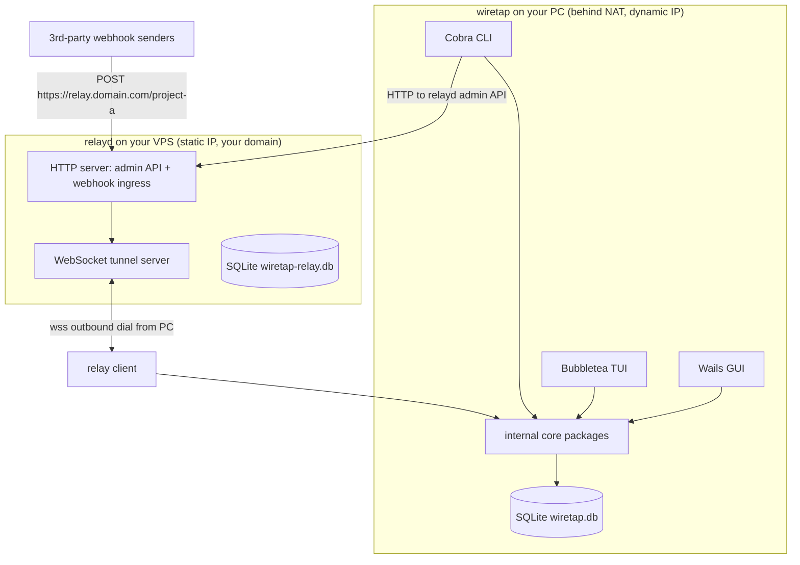
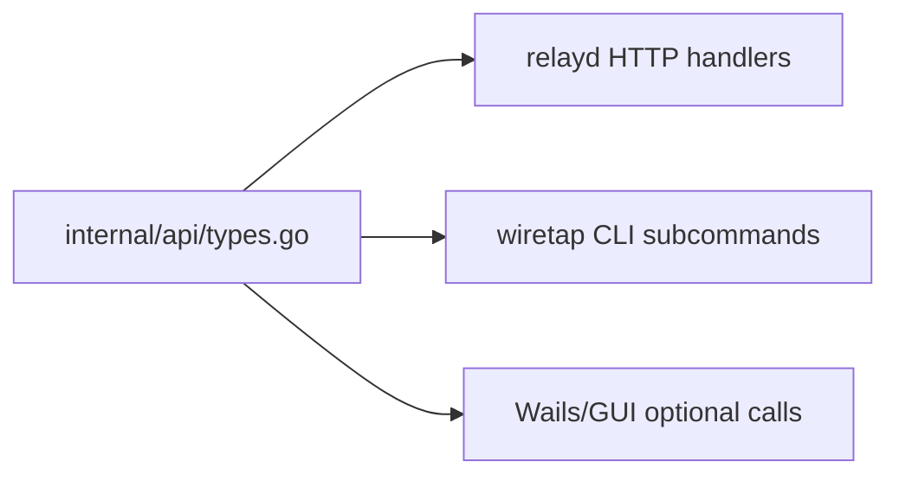

# wiretap — Project Plan

> Capture HTTP traffic and webhooks locally, replay them, and receive inbound
> webhooks from the internet via a self-hosted relay on your VPS — all from one
> CLI/GUI/TUI app. Linux first; Windows + macOS behind build tags later.

---

## 0. Current status (for fresh agents)

> This section summarises the state of the project. It is the single source
> of truth for "what's landed" when picking up the project without prior
> context. Update it whenever a phase completes or statuses change.

| Phase | Status | Lead commits |
|---|---|---|
| 0 — Scaffolding | ✅ DONE | `35a34f9` |
| 1 — Cross-cutting cores | ✅ DONE | `7683597`, `0bf277a`, `171325c` |
| 2 — relayd HTTP + tunnel | ✅ DONE | `92c354b`, `37fb6a4` |
| 3 — PC relay client + CLI | ✅ DONE | `8479067`, `b01b8b1`, `7af7334` |
| 4 — Traffic interception | ✅ DONE | `tbd` |
| 5 — Wails GUI | ✅ DONE | `88693d8` |
| 6 — Payload scripting, UI upgrade, project mgmt | 🚧 IN PROGRESS | -- |
| 7 — Hardening | ⬜ NOT STARTED | -- |

Latest commit on `main`: `7af7334` (Phase 5 work uncommitted at time of
writing). Calendar date July 2026 (this is just a reference; treat the commit
graph as ground truth).

All tests pass under `go test -race -shuffle=on ./...`. Coverage per package:

| Package | Coverage | Notes |
|---|---|---|
| `internal/relayproto` | 97.6% | Sealed Message union |
| `internal/scripting` | 86.4% | goja sandbox + builtins + chain runner (Phase 6.1) |
| `internal/intercept/shellscript` | 99.1% | Golden-file tested |
| `internal/relayclient` | 84.8% | Dialer/Conn/Backoff fakes |
| `internal/cli` | ~73% | Relay subcommands + TUI seam |
| `internal/api` | 74.7% | Typed HTTPClient |
| `internal/config` | 74.6% | Includes credentials round-trip |
| `internal/store` | 64.4% | Real `:memory:` SQLite |
| `internal/relayd` | 70.9% | httptest + real WebSocket |
| `internal/intercept` | 64.4% | Orchestration + Capture→PCStore adapter; `Cleanup` covered via cli tests |
| `internal/intercept/castore` | 34.0% | Pure CA tested; OS trust-store glue needs root |
| `internal/intercept/proxy` | 76.7% | Interception against in-process tls upstream |
| `internal/intercept/overridebin` | 91.7% | Golden-file tested |
| `internal/intercept/localapi` | 100.0% | httptest + fake Querier |
| `internal/tui` | 64.7% | Polls PCStore, truncate tested |
| `internal/gui` | 88.6% | Wails binding layer over `internal/app`; no Wails import (testable without GUI toolchain) |
| `internal/testutil` | 36.4% | Golden helper + fake clock/idgen |
| `cmd/wiretap-relay` | 21.4% | HTTP handler + graceful shutdown |

Commit messages follow Conventional Commits; a `commit-msg` hook backed by
`@commitlint/cli` enforces this locally. See `commitlint.config.js` for the
accepted types and scopes.

`README.md` is intentionally untracked. It will be revisited at the end of
the project. Don't stage it via `git add -A` without excluding it.

## 1. Goals & non-goals

### Goals (MVP)

1. Intercept outbound HTTP/HTTPS traffic from a spawned shell via a local
   interception proxy (env injection), with `stop_interception` for **every** shell.
2. Capture inbound webhooks over the internet using a self-hosted relay (`relayd`)
   on your VPS, with store-and-forward so the local PC never misses a webhook while
   offline.
3. Persist captures in SQLite on both PC and relay; replay any captured webhook.
4. Clean Wails GUI dashboard with two tab modes: **Traffic** and **Webhooks**.
5. Bubbletea TUI behind `wiretap tui`; one-shot CLI via Cobra.
6. Every relay administration capability exposed as **both HTTP routes and CLI
   subcommands** (one API contract, two frontends).
7. Linux-first, cross-platform-ready via build-tag-split seams.
8. Code written to be **testable by default** — this is a Go-learning project, so
   tests are a first-class deliverable, not an afterthought.

### Non-goals (MVP)

- Multi-tenant relay (single owner, single `admin_token`; the schema can grow later).
- Fuzz-testing, formal verification, performance benchmarking at scale.
- Non-HTTPS traffic interception (plain HTTP on port 80) — covered later.
- Mobile clients.
- Authenticated webhook forwarding to multiple downstreams per project (one tunnel
  per client is enough for MVP).

---

## 2. Architecture overview


```mermaid
flowchart TD
    subgraph PC["wiretap on your PC (behind NAT, dynamic IP)"]
        CLI[Cobra CLI]
        TUI[Bubbletea TUI]
        GUI[Wails GUI]
        CORE[internal core packages]
        DB[(SQLite wiretap.db)]
    end

    subgraph VPS["relayd on your VPS (static IP, your domain)"]
        HTTP[HTTP server: admin API + webhook ingress]
            WS[WebSocket tunnel server]
            RDB[(SQLite wiretap-relay.db)]
    end

    SEND[3rd-party webhook senders] -->|POST https://relay.domain.com/project-a| HTTP
    HTTP --> WS
    WS <-->|wss outbound dial from PC| TUN[relay client]
    TUN --> CORE --> DB
    CLI --> CORE
    TUI --> CORE
    GUI --> CORE
    CLI -->|HTTP to relayd admin API| HTTP
```

**Key invariant:** the PC always dials **out** to the VPS (WebSocket over TLS),
so NAT / CGNAT / dynamic home IP never matter. The relay stores webhooks in its
own SQLite and pushes them down the tunnel; the PC acks per-project cursors.

---

## 3. Repository layout

```
wiretap/
  .go-version
  go.mod                                  # module github.com/plutack/wiretap
  LICENSE
  README.md
  .air.toml                               # air live-reload config (GUI dev: watches .go + ui/, recompiles Tailwind, launches window)
  .air.cli.toml                           # air live-reload config (CLI/TUI dev: watches .go, launches tui)
  doc.go                                  # package guiassets (root-level doc; embed lives in guiassets.go)
  guiassets.go                            # //go:build gui — embeds ./ui as the Wails frontend FS
  Makefile                                # build targets: build (CLI/TUI), gui (auto-detects webkit tag), test, vet
  wails.json                              # Wails v2 project config (frontend:dir = ui)
  docs/
    PLAN.md                               # this file
  ui/                                     # Wails frontend (vanilla JS + Tailwind v4, no framework)
    index.html                            # two-tab dashboard shell
    app.js                                # calls wailsjs/go/gui/Bindings.js
    input.css                             # Tailwind v4 entry
    output.css                            # compiled Tailwind (committed; embedded by guiassets.go)
    wailsjs/                              # auto-generated by `wails generate module`; committed for build reproducibility
  cmd/
    wiretap/                              # local app (CLI + TUI + GUI host)
      main.go                            # cobra root; dispatches to subcommands
    wiretap-relay/                       # standalone relay server binary for the VPS (package main; binary name `wiretap-relay`)
      main.go
  internal/
    app/                                 # wires deps together for the local app
    config/                              # Viper config loading, paths, defaults
    api/                                 # shared request/response types (HTTP contract)
      client.go                          # typed HTTP client used by CLI
      server.go                          # handler constructors (used by relayd)
      types.go                           # DTOs: Client, Project, Webhook, etc.
    store/                               # SQLite (modernc.org/sqlite, pure Go)
      migrations/                        # *.sql files, applied in order
      pc.go                              # local PC store: webhooks, captures, cursor
      relay.go                           # relay store: clients, projects, webhooks
      pc_test.go
      relay_test.go
      testutil_test.go                   # helpers for opening an isolated SQLite
    intercept/                           # traffic interception
      proxy/                             # interception proxy core (pluggable transport)
      shellscript/                       # per-shell script generators
        bash.go bash_test.go
        fish.go fish_test.go
        powershell.go powershell_test.go
        gitbash.go gitbash_test.go
        doc.go                           # ShellScript(env) -> string dispatcher
      overridebin/                       # shim scripts for git/curl/node/etc.
      castore/                           # CA install (build-tag split)
        castore.go                        # interface
        castore_linux.go                 # #build linux
        castore_darwin.go                # #build darwin
        castore_windows.go               # #build windows
        castore_fake_test.go              # in-memory impl for tests
      intercept.go                       # Start/Stop orchestration w/ deps injected
    relayproto/                          # tunnel message types + encode/decode
      message.go                         # HELLO/ACK/REPLAY/PUSH/OK/ERROR
      message_test.go                    # round-trip, table-driven
    relayclient/                         # PC-side tunnel client
      client.go                          # dial, reconnect, send/recv loop
      client_test.go                     # against httptest.Server + real ws
    relayd/                              # relay server (importable package; named `relayd` since Go package names can't hyphenate)
      server.go                          # HTTP routes + WebSocket upgrade
      server_test.go                     # httptest + in-memory store
      auth.go                            # admin_token + client_token validation
      auth_test.go
    cli/                                # cobra command tree (root + subcommands incl. relay HTTP API wrappers)
      root.go version.go config.go
      clients.go projects.go webhooks.go
      relay.go tui.go intercept.go
      gui.go                             # //go:build gui — Wails launcher (`wiretap gui`)
      gui_stub.go                        # //go:build !gui — stub that errors with build instructions
      clients_test.go                    # against httptest.Server
    tui/                                  # bubbletea models
      model.go
      updates_test.go                    # Msg/Model table-driven
    gui/                                  # Wails binding layer (no Wails import; testable without GUI toolchain)
      bindings.go                        # ListWebhooks/ListCaptures/GetWebhook/ReplayWebhook/Status over *app.App
      bindings_test.go                   # real temp-dir SQLite; replay against httptest
    testutil/                            # shared test helpers (clocks, ids, tmp dirs)
      clock.go idgen.go golden.go
```

Build-tag convention: `//go:build linux`, `//go:build darwin`, `//go:build
windows`. Non-Linux files can be stubs returning `ErrUnsupportedOS` initially;
implementations land when tested on those OSes.

---

## 4. Testability principles (this is a learning project)

Codified rules every package obeys:

1. **Interfaces at every external boundary.** Each collaborator a package uses is
   passed in as a small interface, defined at the point of use (consumer-side
   interfaces, Go's implicit satisfaction). Examples:
   - `store.Store` for persistence (both `PCStore` and `RelayStore`).
   - `relayproto.Transport` for the WebSocket conn (so tests use fakes).
   - `clock.Clock` and `idgen.IDGen` so tests are deterministic.
   - `castore.Installer` for CA trust-store mutation.
2. **Constructor injection with functional options.** Public types expose
   `New(opts ...Option)`; `WithStore`, `WithClock`, `WithIDGen`, `WithLogger`
   let tests substitute any dep. Production wiring in `internal/app` passes
   concrete implementations.
3. **No package-level mutable state.** No `var now = time.Now`. No globals
   holding config. Everything flows through a struct.
4. **Pure functions where possible.** `shellscript.Bash(env)` is `func(env Env)
   string` — no I/O, trivially table-tested.
5. **Table-driven tests are the default.** Every test that has ≥2 cases is a
   `tests := []struct{...}{...}` loop with `t.Run(tc.name, ...)`.
6. **Real SQLite in tests.** Open `:memory:` (or a tmp file via `t.TempDir()`)
   for each test; avoid mocking the database. Migrations run in a helper.
7. **`httptest.Server` for HTTP.** Relay admin routes and the tunnel WebSocket
   are tested against an in-process `httptest.NewServer`.
8. **Golden files for generated shell scripts.** `internal/intercept/shellscript`
   uses `testdata/*.golden` snapshots; `go test -update` refreshes them.
9. **`t.Cleanup`** for resources (DBs, temp dirs, servers).
10. **Stdlib first, minimal helpers.** We use `testing` + a tiny `internal/testutil`
    (fake clock, fixed ID generator, golden helpers). No testify unless a clear
    payoff emerges — keeps the learning surface focused.
11. **Tests live next to code**, named `foo_test.go` (white-box, same package) by
    default; use `package foo_test` (black-box) only when testing the public API
    surface specifically.
12. **One behaviour per test** where feasible; composite flows live in `_test.go`
    `TestIntegration*` functions gated behind a build tag if slow.

Learning checklist I will intentionally demonstrate in the first few packages:

- subtests (`t.Run`) and `t.Parallel()` for independent cases
- `t.Helper()` in assertion helpers
- `t.TempDir()` and `t.Setenv()` (Go 1.17+; we're on 1.26)
- `errors.Is` / `errors.As` in error assertions
- `testing.TB` parameters so helpers accept both `*testing.T` and `*testing.B`
- `go test -race` (always on locally); CI runs `-race -shuffle=on`
- coverage gates: aim ≥85% on `internal/relayproto`, `internal/store`,
  `internal/intercept/shellscript` (the pure-logic cores)

---

## 5. The "HTTP + CLI compatible" pattern

There is **one API contract** in `internal/api/types.go` — request/response DTOs
used by three consumers:


```mermaid
graph LR
    T[internal/api/types.go]
    T --> H[relayd HTTP handlers]
    T --> C[wiretap CLI subcommands]
    T --> G[Wails/GUI optional calls]
```

- `relayd` registers HTTP routes: `POST /register`, `GET /clients`,
  `GET /projects`, `POST /projects` (reclaim), `GET /projects/:p/webhooks`,
  `POST /projects/:p/webhooks/:seq/replay`, `GET /health`. All JSON, all using
  `internal/api` types.
- `wiretap relay clients list` (and friends) instantiate `api.Client` (a typed
  HTTP client) pointed at `relay.url` with auth headers, call the same routes,
  and pretty-print the JSON. So `curl` and `wiretap relay ...` hit the **same**
  endpoints with the **same** payloads.
- This means a new admin capability follows a fixed recipe:
  1. define types in `internal/api`
  2. add the HTTP handler in `internal/relayd/server.go` (+ test)
  3. add the CLI subcommand in `internal/clitwo` (+ test using `httptest`)
  4. (optional) wire into TUI/GUI

Open question for you (answer before phase 4): should the **local app** also
expose a 127.0.0.1 HTTP control API so external scripts can query captures
(`GET http://127.0.0.1:PORT/local/webhooks`)? Cheap to add and matches the
"everything is an HTTP API" theme; useful for automation. Default: **yes**, add
it. I'll confirm before building.

---

## 6. Data models

### relayd SQLite (`relay.db`)

```sql
CREATE TABLE clients (
    client_id     TEXT PRIMARY KEY,
    client_token  TEXT NOT NULL,
    display_name  TEXT,
    created_at    INTEGER NOT NULL,
    last_seen_at  INTEGER
);

CREATE TABLE projects (
    path         TEXT PRIMARY KEY,        -- "project-a"
    client_id    TEXT NOT NULL REFERENCES clients(client_id) ON DELETE CASCADE,
    created_at   INTEGER NOT NULL,
    acked_seq    INTEGER NOT NULL DEFAULT 0   -- relay's view of PC cursor per project
);

CREATE TABLE webhooks (
    project      TEXT NOT NULL REFERENCES projects(path) ON DELETE CASCADE,
    seq          INTEGER NOT NULL,
    received_at  INTEGER NOT NULL,
    source_ip    TEXT,
    method       TEXT NOT NULL,
    path         TEXT,                    -- full nested path after project segment
    headers      TEXT NOT NULL,           -- JSON
    body         BLOB,
    delivered    INTEGER NOT NULL DEFAULT 0,
    delivered_at INTEGER,
    PRIMARY KEY (project, seq)
);
CREATE INDEX idx_undelivered ON webhooks(project, seq) WHERE delivered = 0;
```

### wiretap PC SQLite (`wiretap.db`)

```sql
CREATE TABLE webhooks (
    project      TEXT NOT NULL,
    seq          INTEGER NOT NULL,
    received_at  INTEGER NOT NULL,        -- from relay
    stored_at    INTEGER NOT NULL,        -- local arrival time
    source_ip    TEXT,
    method       TEXT,
    path         TEXT,
    headers      TEXT,
    body         BLOB,
    PRIMARY KEY (project, seq)            -- dedup by (project, seq) on reconnect
);

CREATE TABLE traffic_captures (
    id           INTEGER PRIMARY KEY AUTOINCREMENT,
    at           INTEGER NOT NULL,
    method       TEXT,
    url          TEXT,
    req_headers  TEXT,
    req_body     BLOB,
    status       INTEGER,
    resp_headers TEXT,
    resp_body    BLOB
);

CREATE TABLE relay_cursor (
    project      TEXT PRIMARY KEY,
    last_seq     INTEGER NOT NULL
);  -- authoritative cursor; used in HELLO on reconnect
```

---

## 7. Tunnel protocol (WebSocket over TLS)

Message envelope is a tagged JSON union. Defined in `internal/relayproto`.

```
PC → relayd:
  HELLO    { type: "hello", client_id, client_token, last_seqs: { "project-a": 420 } }
  ACK      { type: "ack", project, up_to_seq }
  REPLAY   { type: "replay", project, seqs: [422, 423] }   # re-deliver to local

relayd → PC:
  OK       { type: "ok", projects: ["project-a"], resume_from: { "project-a": 420 } }
  PUSH     { type: "push", project, seq, method, path, headers, body, received_at, source_ip }
  ERROR    { type: "error", code, message }
```

Reliability rules (already discussed, locked here):

- PC declares `last_seqs` on every HELLO; relay treats it as ground truth.
- Idempotent on PC: `INSERT OR IGNORE` keyed by `(project, seq)`.
- Reconnect uses exponential backoff 1s→30s with jitter; ping/pong every 30s.
- Relay retains delivered rows for a TTL (default 7d), then vacuums.
- After a successful `ACK up_to_seq=N`, relay updates `projects.acked_seq`.

---

## 8. HTTP API (relayd)

All routes return JSON. Admin routes require `X-Admin-Token`; client routes
require `Authorization: Basic client_id:client_token` OR a tunnel-attached
session.

| Method | Path | Auth | Purpose |
|---|---|---|---|
| POST | `/register` | admin | claim `client_id`/`client_token` + bind projects |
| GET | `/health` | none | liveness |
| POST | `/inbox/:project` (alias `/`) | none | ingress for webhooks (path preserved) |
| GET | `/admin/clients` | admin | list clients |
| GET | `/admin/clients/:id` | admin | client detail + bound projects |
| DELETE | `/admin/clients/:id` | admin | revoke client (frees its projects) |
| GET | `/admin/projects` | admin | list projects + acked_seq |
| POST | `/admin/projects` | admin | reclaim a path under a new client (`--force`) |
| GET | `/admin/projects/:p/webhooks` | admin/owner | paginated history |
| POST | `/admin/projects/:p/webhooks/:seq/replay` | admin/owner | re-push to PC over tunnel |
| GET | `/tunnel` | client | WebSocket upgrade (the tunnel itself) |

Path-naming regex for `:project`: `^[a-z0-9][a-z0-9-]{1,62}$`. Reserved roots:
`tunnel`, `register`, `admin`, `health`.

---

## 9. Module-by-module testing map

| Package | Test style | Doubles |
|---|---|---|
| `internal/relayproto` | Table-driven encode/decode round-trips | none (pure) |
| `internal/store` | Real `:memory:` SQLite per test | none |
| `internal/relayd` | `httptest.NewServer` + in-memory store + real WS handshakes | `FakeStore`, `FakeClock`, `FakeIDGen` |
| `internal/relayclient` | `httptest.NewServer` upgraded to WS | `FakeTransport`, `FakeStore` |
| `internal/cli` | `httptest.NewServer` + stdlib assertions | `FakeClock` |
| `internal/intercept/shellscript` | Golden files + table-driven | none (pure) |
| `internal/intercept/proxy` | `httptest.NewTLSServer` as upstream | `FakeCA` |
| `internal/intercept/castore` | interface-only tests using `castore_fake_test.go` | `FakeInstaller` |
| `internal/tui` | `Model`/`Msg` table-driven with tea `TestModel` | `FakeStore` |
| `internal/config` | `t.TempDir()` + `t.Setenv()` | none |
| `internal/gui` | Real temp-dir SQLite via `app.App`; `httptest` for replay | none (no Wails import) |
| `internal/app` | Light integration: wire real deps, exercise one end-to-end flow | none (integration) |

---

## 10. Build phases (what lands in what order)

Each phase ends with a green test suite for its packages before moving on.

### Phase 0 — Scaffolding (no behaviour)  ✅ DONE

**Lead commit:** `35a34f9` — feat: scaffold wiretap and wiretap-relay binaries

- ✅ Rename module to `github.com/plutack/wiretap` in `go.mod`.
- ✅ Create directory layout above (empty `doc.go`s).
- ✅ `cmd/wiretap/main.go`: cobra root with `version`, `config init` only.
- ✅ `cmd/wiretap-relay/main.go`: serves `/health` and exits cleanly.
- ✅ `internal/config`, `internal/testutil` baselines.
- ✅ Wire `go test ./...` clean (zero tests pass trivially).

### Phase 1 — Cross-cutting cores (pure logic, easiest to test)  ✅ DONE

**Lead commits:** `7683597`, `0bf277a`, `171325c`

- ✅ `internal/relayproto` types + encode/decode + table tests
  (97.6% coverage, table-driven round-trip tests, sealed Message interface
  with direction validation).
- ✅ `internal/store` migrations + `RelayStore` + `PCStore` + tests
  (modernc.org/sqlite, embedded migrations, sentinel errors
  ErrNotFound/ErrConflict, `next_seq`/`acked_seq` decoupled per the bug
  fix in `37fb6a4`).
- ✅ `internal/intercept/shellscript` dispatcher + bash/fish/powershell/gitbash
  generators + golden files (99.1% coverage, `wiretap_stop_interception`
  injected into every shell with env-var snapshot/restore).
- ✅ Raw header preservation (`raw_headers` BLOB) — commit `171325c`.

### Phase 2 — relayd MVP (HTTP + tunnel)  ✅ DONE

**Lead commits:** `92c354b`, `37fb6a4`

- ✅ `internal/api/types.go` DTOs + typed `HTTPClient` with `Is*` error
  classification helpers (74.7% coverage, one contract consumed by relayd
  and CLI).
- ✅ `internal/relayd` Server: `/health`, `POST /register` (admin token),
  `POST /:project` ingress (raw body + raw_headers preserved, 10MiB cap,
  404 on unknown projects), `/admin/clients` (list/get/delete with
  cascade), `/admin/projects` (list + reclaim with `--force`),
  `/admin/projects/:p/webhooks` (paginated).
- ✅ Auth: `requireAdmin` (X-Admin-Token constant-time compare) +
  `authClientByBasic` on tunnel upgrade.
- ✅ `GET /tunnel` WebSocket handler using `github.com/coder/websocket`,
  `TunnelRegistry` with one live session per project, `pushIfTunnelAttached`
  for live webhook delivery.
- ✅ CLI subcommands in `internal/cli/relay.go` wrapping every admin route
  (commit `b01b8b1`). Same DTOs as HTTP, so curl and `wiretap relay ...`
  are interchangeable.
- ✅ Integration test: register → ingress → tunnel PUSH → PC ACK →
  `acked_seq` advanced — `TestTunnel_HappyPath` in
  `internal/relayd/tunnel_test.go`.

### Phase 3 — wiretap local (relay client + CLI)  ✅ DONE

**Lead commits:** `8479067`, `b01b8b1`, `7af7334`

- ✅ `internal/relayclient` dial/reconnect/recv loop
  (84.8% coverage; `Dialer`/`Conn`/`Backoff` interfaces with fakes;
  exponential backoff 1s→30s ±50% jitter; `INSERT OR IGNORE` makes
  re-pushes after reconnect safe; `Callbacks` for TUI/GUI subscription).
- ✅ Cursor loading/saving via `PCStore.LastSeq` per project; HELLO advertises
  per-project cursor.
- ✅ `wiretap relay register` (with `--save` for credentials file),
  `wiretap relay clients list|get|delete`,
  `wiretap relay projects list|reclaim`,
  `wiretap relay webhooks list|replay`.
- ✅ Credentials file `~/.config/wiretap/relay-credentials.json` (mode 0600);
  `config.Manager.LoadCredentials` / `SaveCredentials`.
- ✅ TUI stub: `wiretap tui` opens a Bubbletea dashboard that polls `PCStore`
  every 500ms and renders the latest 100 webhooks (project/seq/method/path/
  body bytes). The relay tunnel runs in a background goroutine through the
  shared `internal/app` composition root (non-fatal when relay URL or
  credentials are missing; the TUI shows historical data). The status bar
  also shows `watching: <projects>`, the snapshot the relay sent back on
  tunnel connect (via `relayclient.OnConnect`).
- ✅ Integration test across two in-memory SQLite DBs:
  `TestClientRelay_HappyPath` and `TestClientRelay_OfflineIngressStreamsOnConnect`
  in `internal/relayclient/integration_test.go`.

### Phase 4 — Traffic interception  ✅ DONE

- ✅ `internal/intercept/castore` pure ECDSA P-256 CA (`GenerateCA` +
  `CA.LeafCert`) verified against the issuing root, with build-tag-split
  `Installer` (Linux `update-ca-certificates` glue, darwin/windows stubs
  returning `ErrUnsupportedOS`) and an in-memory `FakeInstaller` (build-tag-
  split `NewInstaller`). Coverage 34% — the pure crypto is tested; the OS
  trust-store glue needs root, like `cmd/wiretap-relay` is lightly covered.
- ✅ `internal/intercept/proxy` interception core: standard forward-proxy protocol;
  CONNECT terminates, signs a per-host leaf on the fly, re-issues the request
  upstream over a separate TLS dial, records each exchange. Tested end-to-end
  against an in-process `httptest` TLS upstream with a real CA. Coverage 76.7%.
- ✅ `internal/intercept/overridebin` POSIX `#!/bin/sh` shim generators for
  git/curl/node (resolve the real binary by skipping the override dir on PATH,
  then exec with proxy/CA pins). Golden files + table tests. Coverage 91.7%.
- ✅ `internal/intercept` orchestration: `Start` (ensure CA → write override-bin
  → append guarded `# --wiretap-intercept--` block to startup files → start
  proxy → start local control API), `Session.Stop`, `Session.SpawnShell`, and
  `Cleanup` (for `wiretap intercept stop` crash recovery). Pure helpers
  (`GuardBlock`, `Inject/RemoveStartupBlock`, `startupFilesFor`, `ShellCommand`)
  are unit-tested; `SpawnShell` is interactive glue.
- ✅ `internal/intercept/localapi` 127.0.0.1 control HTTP API: `GET
  /local/health`, `GET /local/webhooks?project=&limit=`, `GET /local/captures
  ?limit=` with limit clamping. Coverage 100%.
- ✅ `wiretap intercept start` (`--shell`, `--no-shell`) and `wiretap intercept
  stop` cobra subcommands in `internal/cli/intercept.go`, with `detectShellKind`
  (flag → config → `$SHELL`). Seams (`interceptStart`/`interceptSpawn`/
  `interceptCleanup`) keep the CLI testable without binding ports / spawning shells.
- ✅ `internal/config`: added `Intercept` section (`proxy_addr`, `local_api_addr`,
  `shell`) with defaults `127.0.0.1:8888` / `127.0.0.1:9876` / `""`.

All tests green under `go test -race -shuffle=on ./...`.

### Phase 5 — Wails GUI  ✅ DONE

- ✅ `internal/gui` binding layer over `internal/app` (88.6% coverage). No
  Wails import — pure marshaling adapter with JSON-friendly views
  (`WebhookView`, `CaptureView`, `StatusView`, `ReplayResult`). Methods:
  `ListWebhooks`, `ListCaptures`, `GetWebhook`, `ReplayWebhook`, `Status`.
  Tested with real temp-dir SQLite + `httptest` for replay, same style as
  `internal/app/app_test.go`.
- ✅ `app.App.TunnelRunning()` and `app.App.ConnectedProjects()` added
  (lock-guarded read for the GUI status bar). The default tunnel factory
  (`app.defaultTunnelFactory`, a method value) subscribes to
  `relayclient.OnConnect` / `OnDisconnect` so the App learns which projects
  the relay says this client owns — the same OK payload the protocol already
  sent, now surfaced in the GUI and TUI status bars.
- ✅ `ui/` frontend: vanilla JS + Tailwind v4 (no framework, no node_modules).
  `index.html` two-tab shell (Webhooks / Traffic), `app.js` calls the
  auto-generated `wailsjs/go/gui/Bindings.js`, `output.css` compiled from
  `input.css` via the standalone `tailwindcss` CLI and committed (embedded).
  Webhook detail pane shows headers + body + a replay-to-local-target form;
  traffic detail pane shows method/URL/status/byte-counts. 2s polling for
  list refresh, 5s for status.
- ✅ Wails bindings generated via `wails generate module` (temporary root
  `main.go` used for generation, then deleted). `ui/wailsjs/` committed for
  build reproducibility — `go build -tags gui` works without the wails CLI.
- ✅ `guiassets.go` (`//go:build gui`) embeds `./ui` via `//go:embed all:ui`;
  `doc.go` keeps the root `guiassets` package present when the tag is off.
  Wails auto-discovers `index.html` in the embed.FS and strips the `ui/`
  prefix (`iofs.Sub`), so the raw FS is passed straight to `options.App.Assets`.
- ✅ `internal/cli/gui.go` (`//go:build gui`) launches the window via
  `wails.Run`, wiring `*app.App` → `gui.Bindings` → `options.App.Bind`.
  `internal/cli/gui_stub.go` (`//go:build !gui`) registers a `wiretap gui`
  command that errors with rebuild instructions, so the default build stays
  Wails/CGO/webkit-free and `go test -race ./...` is green without the GUI
  toolchain. `wiretap gui` appears in `--help` for both builds.
- ✅ Build verified: `go build ./...` (default) and `go build -tags gui
  ./cmd/wiretap` both clean. `go test -race -shuffle=on ./...` green.

Build-tag convention for the GUI. The default `go build ./...` (or `make build`)
produces the CLI/TUI-only binary (no Wails/CGO/webkit dependency). A working GUI
build needs three tags — `make gui` sets them for you, or build manually:

    go build -tags 'gui,production,webkit2_41' ./cmd/wiretap
    ./wiretap gui

  - `gui` — our gate (keeps the default build Wails-free)
  - `production` — Wails' real-app gate; without it, Wails' own build-tag stub
    returns "will not build without the correct build tags" at runtime
  - `webkit2_41` — Wails' webkit API selector (4.1 on most current Linux
    distros; `webkit2_40` on systems with webkit2gtk-4.0). The Makefile probes
    pkg-config and picks the right one.

This mirrors the project's existing build-tag-split seam philosophy (see
`internal/intercept/castore`). `make gui-debug` builds with devtools enabled.

Live-reload dev with `air` (watches files, rebuilds + relaunches on change):

    make watch          # GUI dev: .air.toml (Tailwind + go build + launch window)
    make watch-cli      # CLI/TUI dev: .air.cli.toml (go build + launch tui)

The GUI air config recompiles Tailwind (`pre_cmd`) before each Go build so the
embedded `ui/output.css` is always fresh. Both configs write to `tmp/` (git-
ignored) and clear the screen between rebuilds.

### Cleanup pass — dead config field + TUI consolidation

- ✅ Removed the dead `relay.projects` field from `internal/config`.
  Production never read it — the tunnel got its project list from
  `relay-credentials.json` (set by `wiretap relay register --save`), and
  the relay is the source of truth that rejects ingress to unclaimed
  paths. The field was leftover scaffolding from Phase 0 and would have
  drifted into a third copy of the truth. `config.Default` and the two
  `config_test.go` assertions updated.
- ✅ Consolidated the TUI onto the shared `*app.App` composition root.
  `internal/cli/tui.go` previously had its own `newPCStore` /
  `startTunnelBackground` / `relayClientConfig` / `noopRunner` /
  `runner` / `newRelayClientRunner` seams that duplicated app.App's job.
  Deleted; the TUI now uses `app.New` + `Open` + `StartTunnel` exactly
  like the GUI, which fixed a nil-store panic on fresh installs (default
  `store.path: ""` previously made `newPCStore` return nil). The TUI
  model accepts an optional `WithConnectedProjects` getter and renders
  `watching: <projects>` in its status bar.
- ✅ `internal/gui/bindings.go` `StatusView` gained `ConnectedProjects []string`;
  `ui/app.js` renders it in the header as `watching: <projects>` (or
  `—` while the tunnel is up but no OK has arrived, or `tunnel down` when
  the tunnel isn't connected).
- ✅ Tests: `internal/app/app_test.go` `TestApp_ConnectedProjects_RoundTrip`
  (the returned slice is a copy, not an alias); `internal/gui/bindings_test.go`
  `TestBindings_Status_ReflectsConnectedProjects` exercises the
  `App.SetConnectedProjects` test seam (production wires it via OnConnect;
  tests with a noop tunnel inject the snapshot directly).

All tests green under `go test -race -shuffle=on ./...`; both default and GUI
builds (`make build`, `make gui`) clean.

### Phase 6 — Payload scripting, UI upgrade, and project management  🚧 IN PROGRESS

> This is the feature phase: the core plumbing works, now we make wiretap
> genuinely useful for real webhook development. The theme is **full control**:
> edit any payload, script any transformation, manage projects from the GUI,
> and find anything fast.

#### 6.1 — JS scripting engine (goja)

- ✅ Embed [goja](https://github.com/dop251/goja) (pure Go ES5.1+/ES6
  interpreter — no CGO, no external runtime to bundle, consistent with the
  project's pure-Go CLI philosophy). Uniquely suited: it evaluates JS
  in-process, supports arrows/classes/let/const/template literals/destructuring/
  Maps/Sets/Promises, and has no V8/CGO dependency. Added as a direct dep.
- ✅ `internal/scripting` package: wraps goja with a fresh-per-run sandboxed
  runtime, built-in helpers (`crypto.hmac`, `crypto.sha256`, `crypto.sha1`,
  `base64.encode/decode`, `json.parse/stringify`, `regex.match/replace`,
  `console.log/error` captured to a log slice), a `reject(reason)` hook, and a
  `Run(ctx, script, *Exchange) (Result, error)` API. The `Exchange` exposes
  `request` (method/url/headers/body) and `response` (status/headers/body) as
  JS globals that scripts mutate in place; headers are flattened to
  single-valued maps for JS ergonomics with `flattenHeader`/`expandHeader`
  helpers to round-trip `http.Header`. A per-run timeout (goja `Interrupt`) and
  ctx cancellation guarantee one runaway script never wedges the caller.
  86.4% coverage.
- ✅ Script types stored in SQLite `scripts` table (id, name, trigger, body,
  priority, enabled, created_at, updated_at) via PC migration `002_scripts.sql`
  and `PCStore` CRUD (`InsertScript`, `UpdateScript`, `SetScriptEnabled`,
  `DeleteScript`, `ScriptByID`, `Scripts`, `ScriptsByTrigger`). Triggers:
  - `on_request` — runs in the interception proxy before the request goes
    upstream. Can modify method, URL, headers, body.
  - `on_response` — runs after the upstream responds, before the response is
    returned to the client. Can modify status, headers, body.
  - `on_replay` — runs when replaying a webhook, before re-POSTing. Can
    modify the stored payload (e.g. regenerate a signature, update a
    timestamp, swap a test token).
  - `on_webhook` — runs when a webhook arrives from the relay, before it's
    stored. Can validate, transform, or reject.
- ✅ Scripts are chainable via `Engine.RunChain(ctx, trigger, scripts, *Exchange)`
  (enabled + matching trigger, ordered by ascending priority), threading the
  same Exchange so each receives the previous one's mutations. A `reject()`
  short-circuits the chain; a script error is recorded per-script in
  `ChainResult.Results` but does NOT stop the chain — one bad script never
  crashes the pipeline. GUI log-pane surfacing is pending the GUI wiring.
- ⬜ Wire `RunChain` into the interception proxy (on_request/on_response), the
  replayer (on_replay), and the relay-webhook ingest path (on_webhook). The
  engine + store are done; the call sites are the remaining backend work.
- ⬜ Script editor in the GUI (CodeMirror 5, ~150KB, vendored offline under
  `ui/vendor/codemirror/` — no CDN, no node_modules; embedded via
  `//go:embed all:ui`) with JS syntax highlighting and a test-run button that
  evaluates against the currently selected capture.

**Why goja over alternatives:**

| Engine | CGO? | ES version | Bundle size | Fit |
|---|---|---|---|---|
| **goja** | No | ES5.1 + most ES6 | Go lib (~2MB compiled) | Best — pure Go, in-process, no external deps |
| v8go | Yes (V8) | Full ES2020+ | V8 runtime (~40MB) | Heavy, CGO breaks CLI portability |
| quickjs-go | Yes | ES2020 | QuickJS (~1MB) | Decent but CGO |
| otto | No | ES5 only | Go lib | No ES6, unmaintained |

#### 6.2 — Full request/response editing

- ⬜ Traffic detail pane: show full request headers, request body, response
  headers, response body (currently only shows byte counts — the data is
  already in `traffic_captures` and `proxy.Capture`, just not displayed).
- ⬜ Editable payloads: user can modify headers + body in the detail pane, then
  "re-send" the modified request through the proxy (or directly upstream).
  The edited request is recorded as a new capture for comparison.
- ⬜ Response editing: same surface — edit the response body/headers that the
  proxy returns to the client. Useful for testing how a client handles
  different responses without modifying the upstream server.
- ⬜ `gui.Bindings.GetCapture(id)` — new binding that returns the full capture
  with headers + bodies (currently `ListCaptures` returns summaries only).
- ⬜ `gui.Bindings.ResendCapture(id, modifications)` — re-issues a capture with
  optional header/body overrides.

#### 6.3 — UI framework upgrade (Preact + htm)

- ⬜ Replace vanilla JS with [Preact](https://preactjs.com/) +
  [htm](https://github.com/developit/htm) (3KB + 1KB, same API as React hooks/
  components, but no build step — works as ES modules from local files).
  Consistent with the current no-node_modules, no-bundler approach.
- ⬜ Component structure:
  - `ui/app.js` — root component, routing, state
  - `ui/components/sidebar.js` — project list + filters + scripts list
  - `ui/components/webhook-list.js` — webhooks table with project filter
  - `ui/components/webhook-detail.js` — headers + body + replay form
  - `ui/components/traffic-list.js` — traffic table
  - `ui/components/traffic-detail.js` — full req/resp editor
  - `ui/components/script-editor.js` — JS script editor + test run
  - `ui/components/status-bar.js` — tunnel status + connected projects
  - `ui/components/search-bar.js` — full-text search input
- ⬜ No JSX (avoids needing a transpiler). htm provides tagged template
  literals for component markup.
- ⬜ Keep Tailwind v4 (already set up); Preact renders into the same DOM.

**Why Preact over React:**

| | Preact + htm | React |
|---|---|---|
| Size | 4KB | 40KB+ |
| Build step | None (ES modules) | Vite/webpack required |
| node_modules | No | Yes |
| API | Hooks, components | Same |
| Fit | Consistent with no-bundler approach | Workable but adds tooling |

#### 6.4 — Project management from GUI

- ⬜ `+ New project` button in the sidebar. Opens a dialog: project name input
  + "Add" button.
- ⬜ `gui.Bindings.AddProject(name)` — new binding that calls `app.App.AddProject`.
- ⬜ `app.App.AddProject(name)`:
  1. POST to relay `/admin/projects/bind` (binds the path to this client_id;
     needs admin token — see auth decision below).
  2. Append `name` to `relay-credentials.json` `projects[]`.
  3. Reconnect the tunnel so the new project is picked up live (cancel +
     restart `StartTunnel`).
  Three-sided write done atomically: relay binding + local creds + tunnel
  reconnect. If any step fails, roll back the prior steps.
- ⬜ `gui.Bindings.RemoveProject(name)` — unbind on relay + remove from creds +
  reconnect. Optional for MVP; can defer.
- ⬜ Relay endpoint: extend `handleReclaimProject` so a missing path creates a
  binding (rather than 404ing), or add `POST /admin/projects/bind`. Reuse
  `store.BindProject`. Conflict -> 409 if another client owns it; `force` to
  take it.
- ⬜ Admin token caching: `wiretap relay register --save` already writes
  `relay-credentials.json` (mode 0600). Add an optional `admin_token` field
  to the credentials file so the GUI can call admin routes without prompting.
  Same trust boundary as the already-saved `client_token`.

#### 6.5 — Sidebar + search + grouping

- ⬜ Left sidebar (resizable):
  - **Projects** section: lists `ConnectedProjects` from the tunnel. Click a
    project to filter webhooks + traffic to that project. "All" shows
    everything.
  - **Scripts** section: lists saved JS scripts (from 6.1). Toggle
    enable/disable per script. Click to edit.
  - **Filters** section: by method (GET/POST/PUT/...), by status code range
    (2xx/3xx/4xx/5xx), by body size threshold.
- ⬜ Search bar (top, full-width): full-text search across method, URL, path,
  request headers, request body, response headers, response body. Uses
  SQLite FTS5 (add a virtual table + triggers to keep it in sync). Debounced
  300ms; results update live.
- ⬜ Group by: project (default), method, host, or status code. Toggle in the
  sidebar.

#### 6.6 — Plugin system

- ⬜ Plugins are JS scripts (from 6.1) with metadata: name, description,
  trigger, priority, enabled. Stored in SQLite `plugins` table.
- ⬜ Built-in plugin library (shipped as JS files in `ui/plugins/`, embedded):
  - `faker.js` — generate fake data (names, emails, UUIDs, addresses) for
    request bodies. Wraps the [faker](https://fakerjs.dev/) API (loaded from
    CDN or vendored locally as a single JS file).
  - `signature.js` — compute HMAC-SHA256 signatures for webhook payloads.
    User provides the secret; the plugin injects the signature header.
  - `timestamp.js` — update `X-Timestamp` or `Date` headers on replay.
  - `validate.js` — JSON schema validation for incoming webhooks.
- ⬜ Plugin import/export: download as `.json` (name + script + metadata),
  import via file picker or drag-and-drop. Shareable between wiretap users.
- ⬜ Plugin chaining: multiple plugins with the same trigger run in priority
  order; each receives the output of the previous one.

---

### Phase 7 — Hardening  ⬜ NOT STARTED

- ⬜ Playground for cross-platform CA on darwin/windows.
- ⬜ Relay token rotation, multi-client admin UI (CLI covers it already).
- ⬜ Docs + README (README.md is currently untracked; revisit at the end).
- ⬜ Cross-distro GUI release builds (webkit2_40 + webkit2_41 variants via
  containerized builds).

---

## 11. Decisions locked

| Area | Decision |
|---|---|
| Name | **wiretap** (module `github.com/plutack/wiretap`) |
| GUI | Wails |
| TUI | Bubbletea, behind `wiretap tui` |
| CLI | Cobra + Viper |
| Storage (both sides) | SQLite via `modernc.org/sqlite` (pure Go, no cgo) |
| Relay protocol | WebSocket over TLS, ack-cursor store-and-forward |
| Relay identification | client_id + client_token; `admin_token` for registration |
| Path routing | `/project-a` — first segment is the project; nested paths preserved |
| Projects per client | multiple (one tunnel, multiplexed) |
| Project reclaim | `--force` + admin token moves a path to a new client_id |
| Path naming regex | `^[a-z0-9][a-z0-9-]{1,62}$` |
| Env markers | `WIRETAP_ACTIVE`, `WIRETAP_OVERRIDE_BIN` |
| Startup-file section | `# --wiretap-intercept--` / `# --wiretap-intercept-end--` |
| Stop interception | injected for every shell; unsets `WIRETAP_ACTIVE` + restores env |
| Cross-platform | Linux first; darwin/windows behind build tags later |
| Go version | `1.26.5` (`.go-version` created) |
| API surface | one contract in `internal/api`; HTTP routes + cobra frontends |
| Testing | stdlib + minimal `internal/testutil`; table-driven; real SQLite; httptest |
| GUI build tags | `gui,production,webkit2_41` — `gui` is our gate; `production` is Wails' real-app gate; `webkit2_41` selects the webkit2gtk-4.1 API (use `webkit2_40` on older systems). `make gui` sets all three |
| Dev workflow | `air` (via `.air.toml`) for GUI live-reload; `air -c .air.cli.toml` for CLI/TUI. `make watch` / `make watch-cli` are convenience wrappers. Makefile targets remain for one-shot builds |
| JS scripting engine | **goja** (pure Go ES5.1+/ES6, no CGO, no external runtime). Scripts run in the interception proxy pipeline + on replay. Chosen over v8go (CGO) and quickjs-go (CGO) to keep the CLI portable |
| Frontend framework | **Preact + htm** (4KB, no build step, no node_modules). Same hooks/components API as React. Chosen over React (needs Vite/webpack) to keep the no-bundler approach |
| Script editor | **CodeMirror** via CDN (~150KB, no node_modules). JS syntax highlighting + test-run button |
| Plugin system | JS scripts stored in SQLite with trigger/priority/enabled metadata. Chainable. Built-in library: faker, signature, timestamp, validate |
| Full-text search | **SQLite FTS5** virtual table + triggers to keep in sync with captures/webhooks. Debounced 300ms in the GUI |
| Admin token in GUI | Cache `admin_token` in `relay-credentials.json` (mode 0600) on `relay register --save`. GUI calls admin routes without prompting. Same trust boundary as `client_token` |
| GUI launch | `wiretap gui` subcommand (not a separate binary); launcher in `internal/cli/gui.go` |

## 12. Open questions (resolved)

1. **Local control HTTP API** — **yes**. The local app exposes a 127.0.0.1 HTTP
   control API so external scripts can query captures (`/local/webhooks`, etc.).
   Built in Phase 4 alongside the interception work.
2. **Relay binary name** — **`wiretap-relay`**. The importable server
   package stays `internal/relayd` (Go package names cannot contain
   hyphens); the binary lives in `cmd/wiretap-relay` and is named
   `wiretap-relay` so it is clearly part of the wiretap family.
3. **`wiretap intercept start` behaviour** — **spawn an interactive shell**
   (env-injection style). Implemented in Phase 4. *(Interpreted as "spawn" from the
   reply; revisit before Phase 4 if this is wrong.)*
4. **Wails version** — **v2** (stable). Migrate to v3 later if it matures.